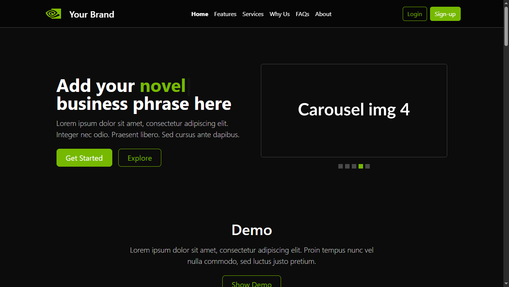

# nvidia-landing-template

**NVIDIA Theme Landing Template** — Mobile-adapted landing page built with Bootstrap 5.

🔗 <a href="https://nvidia-landing-template.netlify.app/#home" target="_blank" rel="noreferrer noopener">Live Preview</a>

  
  

